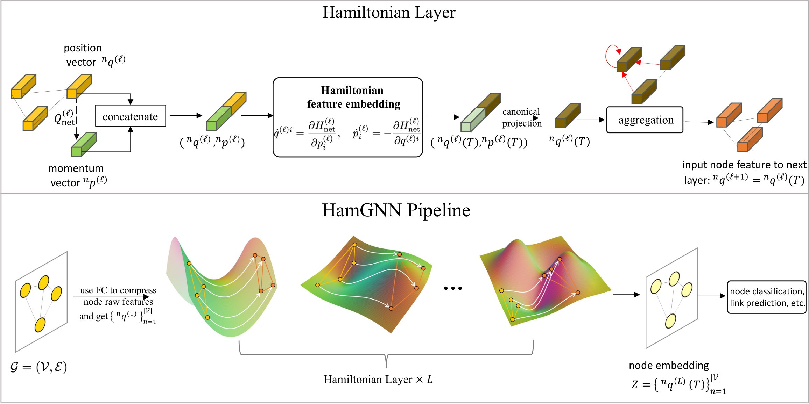
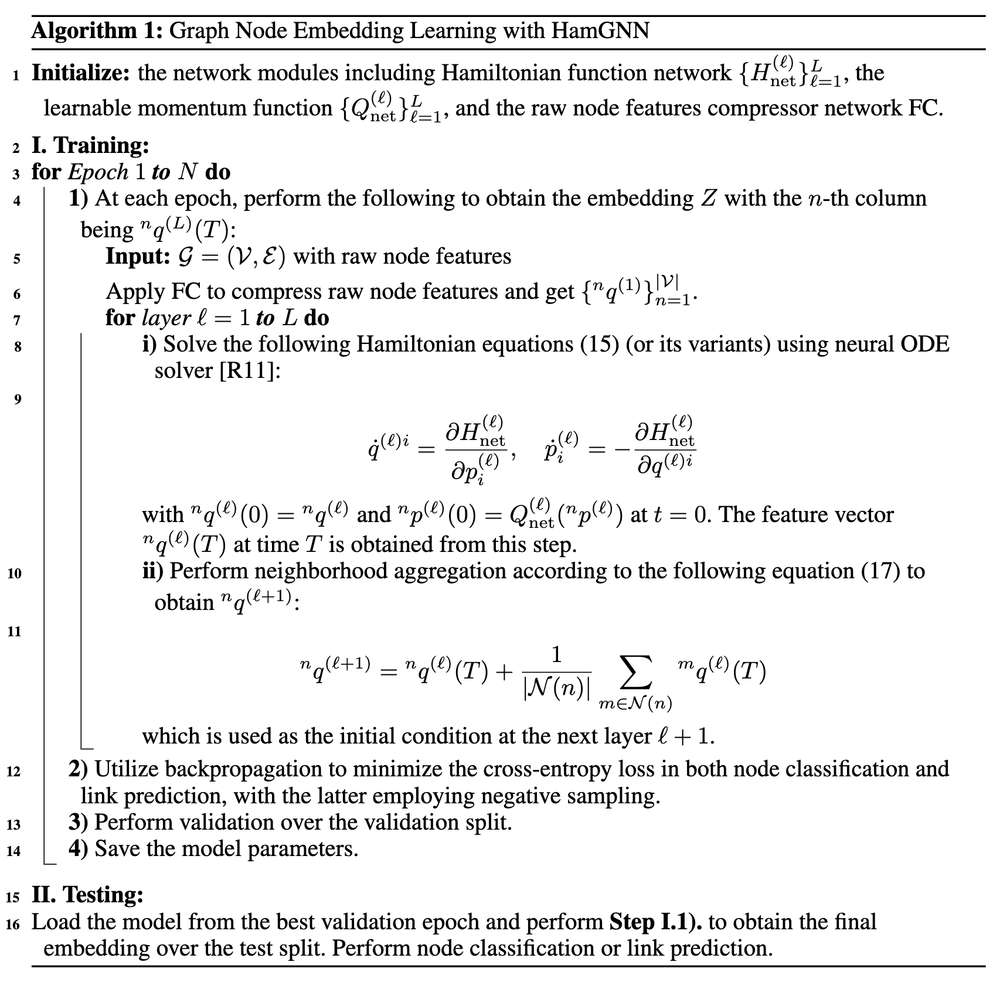
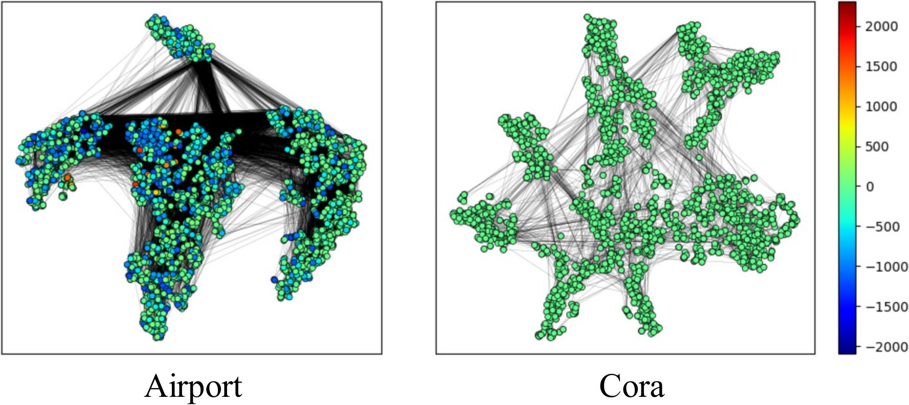

# HamGNN

## Pipeline and Architecture

      

__We present the full training and testing as follows.__

## Learned Curvature Visualization

We now provide the visualization of the learned Ricci scalar curvature (https://en.wikipedia.org/wiki/Ricci_curvature) that is computed from our learnable metric $g$. We use one high $\delta$-hyperbolicity dataset, the Cora dataset, and one low $\delta$-hyperbolicity dataset, the Airport dataset. (Note that higher $\delta$-hyperbolicity means *less* hyperbolic.) 

__Airport:__ We observe that the local curvatures learned on the Airport dataset show various values, ranging from -2000 to +2000. Few embeddings show positive curvature, and most of the embeddings show __negative or near 0 curvature__ at the local geometry. This is expected as hyperbolic GNNs (Chami et al., 2019; Liu et al., 2019) have demonstrated that tree-structured datasets have improved classification accuracy if they are embedded into a hyperbolic space with constant negative curvature rather than the zero curvature Euclidean space. Our model automatically learns to achieve this.
The difference is that in HamGNN with eq.(19), the local curvature varies from point to point based on learning, and some points may even be embedded with a local positive curvature geometry. The visualized learned local curvatures explain why our model can surpass the baselines on the lower $\delta$-hyperbolicity datasets. 

__Cora:__ For the Cora dataset, from the visualization, we observe that almost all the embeddings are located at locations with __near zero curvature__, i.e., similar to the Euclidean space. This is consistent with our results shown in the paper that HamGNN has a comparable performance with Euclidean-based GNNs on high $\delta$-hyperbolicity datasets. Our HammGNN successfully learns to embed the nodes in spaces that closely resemble Euclidean spaces.

The above curvature visualization further demonstrates that the curvature in HamGNN can successfully adapt for different structures of different datasets, and this learnable metric leads to all-around good performance.
